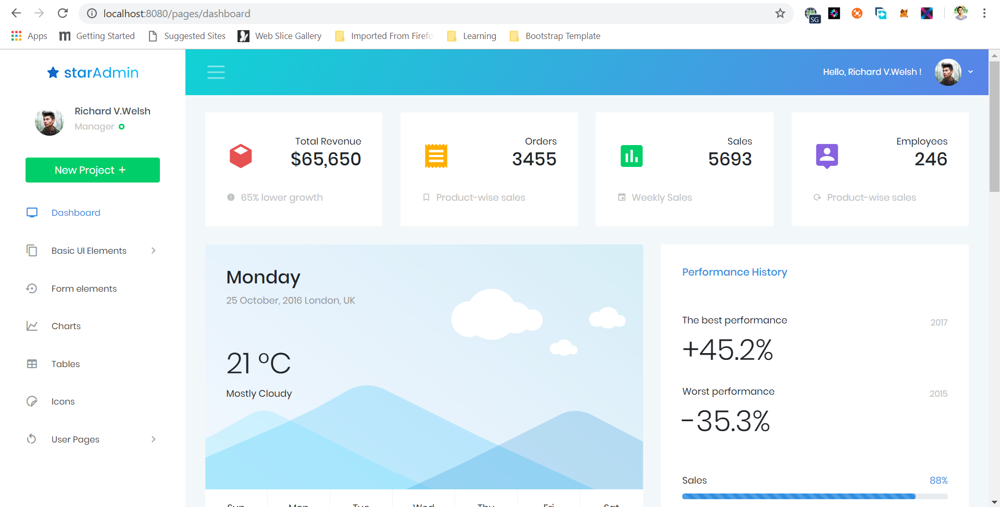

# spring-boot-thymeleaf-staradmin-demo

Spring Boot with Thymeleaf and Star Admin 

## Installation

`https://github.com/mugishalinux/SpringBoot-Thymeleaf-Template.git`

`cd WebAdminExample`

`mvn clean install`

`cd target`

`java -jar WebAdminExample-0.0.1-SNAPSHOT.jar`

### Screenshoot

